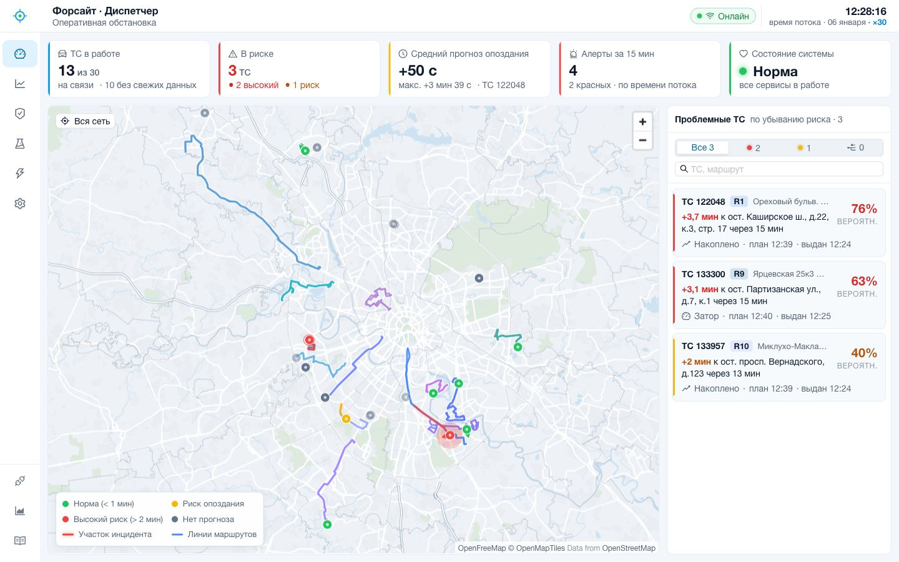
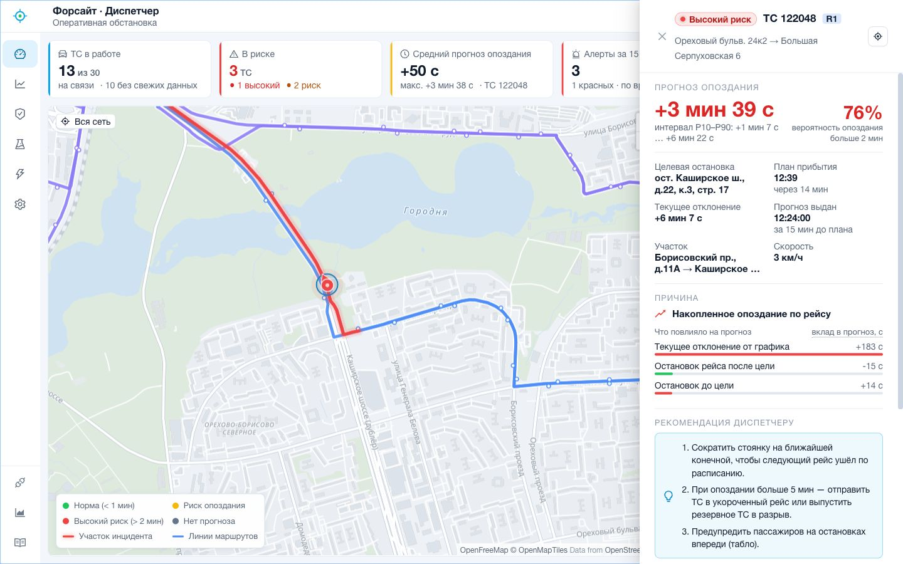
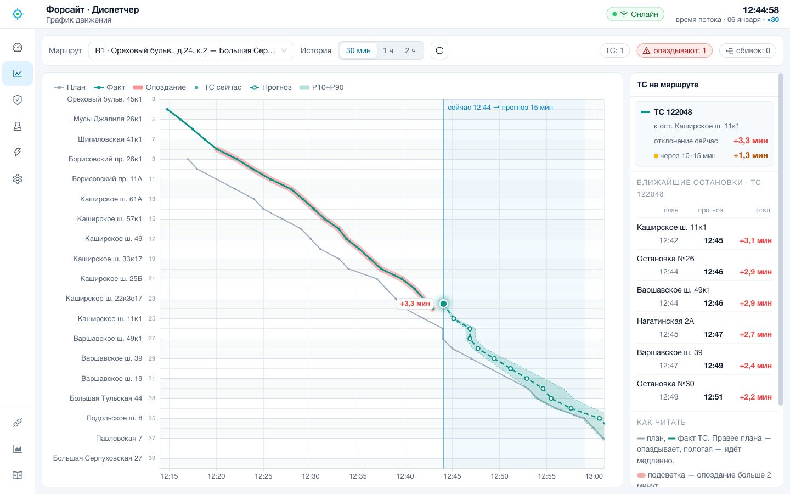
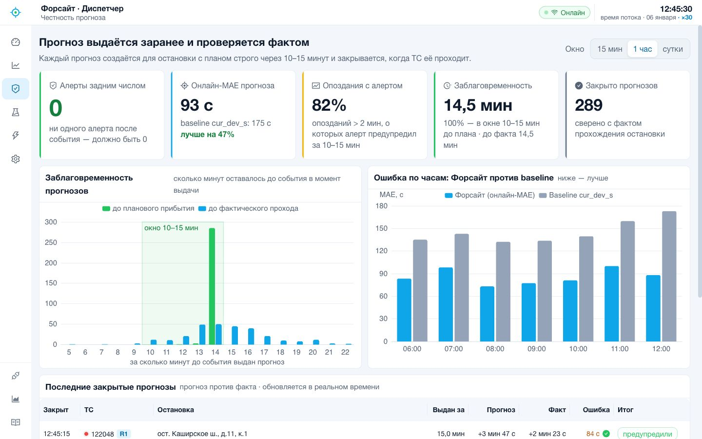
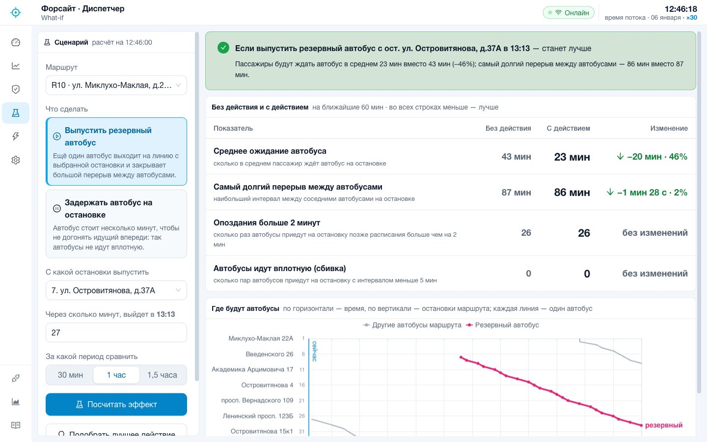
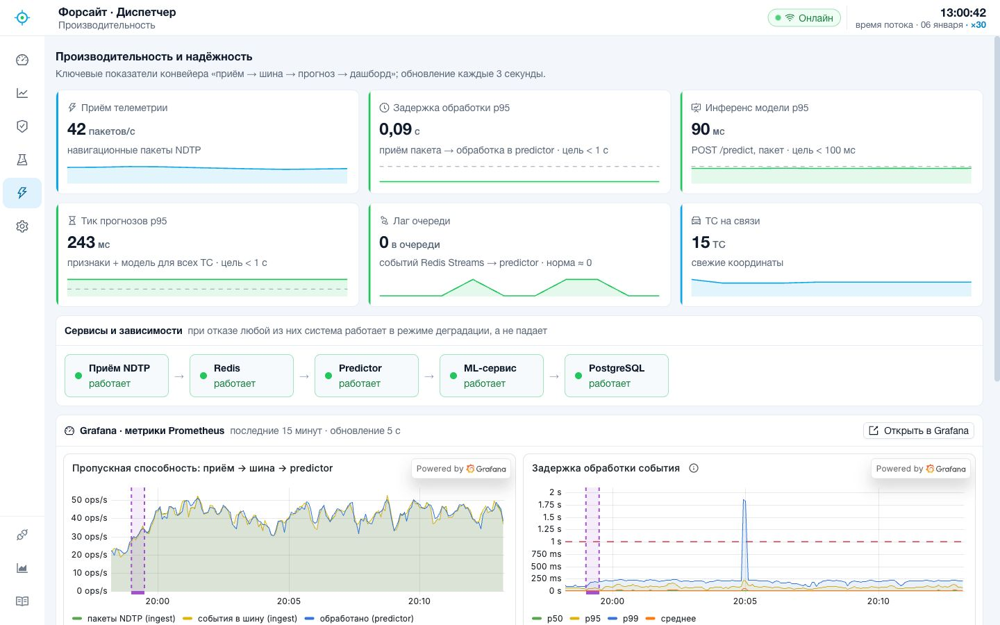

# Форсайт (Foresight)

[](https://github.com/DverkuOff/foresight/actions/workflows/ci.yml)
[](https://dverkuoff.github.io/foresight/)

**Видит сбой графика за 15 минут до того, как он случится.**

Решение кейса «Предиктор изменений в графике движения городского транспорта» (Хакатон Московского транспорта,
2026): по потоковой телеметрии NDTP за 10–15 минут до планового прибытия прогнозирует задержку на остановке,
объясняет причину, поднимает алерты и показывает всё диспетчеру; каждый прогноз затем сверяется с фактом на потоке.

- **Жюри:** [инструкция](docs/jury-guide.md) — запуск одной командой, как подать поток, где смотреть каждый критерий.
- **Документация:** [сайт](https://dverkuoff.github.io/foresight/) — руководства, справочник по коду (Sphinx) и
  [OpenAPI всех сервисов](https://dverkuoff.github.io/foresight/api/) (Swagger).
- Архитектура — [`docs/architecture.md`](docs/architecture.md), отчёт ML — [`docs/ml-report.md`](docs/ml-report.md),
  производительность — [`docs/performance.md`](docs/performance.md), онлайн-проверка —
  [`docs/online-validation.md`](docs/online-validation.md), сторонние компоненты — [`docs/third-party.md`](docs/third-party.md).
- Ограничения решения и план пилота — [в конце README](#ограничения-и-пилотирование), права на материалы — [`LICENSE`](LICENSE).

| Результат | |
|---|---|
| Точность на платформе | score **0.87636** (MAE test 75.8 с против 93.4 с у baseline `cur_dev_s`), `make submission` воспроизводит файл |
| На потоке test-дня | онлайн-MAE 80,6 с против 127,3 с у baseline «отклонение сохранится» (все 4557 закрытых прогнозов), прогнозы только в окне 10–15 мин, задним числом — 0 |
| Задержка | пакет → обработка p95 ≈ 0,05–0,1 с, инференс p95 < 100 мс, лаг очереди 0 |
| Надёжность | отказ приёмника, Redis, PostgreSQL, ML — без падений, с буферизацией и восстановлением (`make chaos`) |

## Как это выглядит

| Оперативная обстановка | Карточка инцидента |
|---|---|
|  |  |
| **График движения маршрута** | **Честность прогноза** |
|  |  |
| **What-if** | **Производительность** |
|  |  |

## Быстрый старт

Нужны Docker Engine ≥ 25 (healthcheck `start_interval`) с Docker Compose ≥ 2.21 (`up --wait --wait-timeout`),
`make` и `curl`. Проверено на Docker 29.2 и Compose v5.0.2; `make up` сам проверяет версии и пишет, чего не хватает
(`DOCKER_CHECK=0` — пропустить). Python на хосте не нужен.

```bash
make dataset    # датасет организаторов по ссылке из ТЗ (Яндекс.Диск) в dataset/ с проверкой sha256
make demo       # собрать образы, поднять стек, дождаться healthy, запустить поток test ×30 с 06:00 по кругу
```

Дальше — **дашборд http://localhost:8080**, Swagger http://localhost:8000/docs, Grafana
http://localhost:3000/grafana/. Датасет в другом месте — `DATASET_DIR=/путь/к/dataset`; образ эмулятора NDTP
`make` загрузит из `dataset/ndtp-telemetry-emulator.tar`, если его нет в Docker.

`make demo` собирает образы `foresight-backend`, `foresight-ml`, `foresight-replayer` и `foresight-dashboard`,
поднимает 13 сервисов (приём, прогнозы, ML, API, дашборд, Redis, PostgreSQL, replayer, эмулятор, Prometheus,
Grafana, экспортёры) и ждёт, пока все станут healthy. Replayer создаётся с автостартом и начинает воспроизведение,
как только приёмник готов: split `test`, x30, с 06:00, по кругу (проход ~36 мин). В конце печатаются адреса.
Замеры запуска ядра на сервере (10 CPU, 25.09.2026):

| Этап | Время |
|---|---|
| сборка образов backend и replayer с нуля (`--no-cache`; базовые образы и колёса уже скачаны) | 16 с |
| сборка с кэшем слоёв | 1–3 с |
| холодный старт ядра: `make clean`, затем `make up` — до healthy | 10–11 с (весь `make up` — 13 с) |
| `make clean`, затем `make demo` — до ТС в api | 12,5 с |
| повторный `make up` / `make demo` на работающем стеке (контейнеры не пересоздаются) | 3 с |

Что видно через минуту (минута стены = 30 мин данных):

- `make status`: все сервисы `HTTP 200 ok`; 30 ТС с `tr_id`, из них ~18 уже с координатами (у остальных в этом
  окне ещё не было пакетов); часы потока 06.01.2026 около 06:30; очередь `lag 0`; `CRC-ошибок 0`; replayer
  `running`, соединений 30/30;
- http://localhost:8000/api/vehicles — ТС с `tr_id`, координатами и `event_time` 06.01.2026; `stream_time` идёт x30;
- http://localhost:8000/docs — Swagger API; http://localhost:8010/docs — управление replayer;
- http://localhost:8002/api/predictor/stats — окна треков и тики прогнозов (тик каждые 30 с потокового времени,
  при x30 — раз в секунду);
- http://localhost:8001/api/ingest/stats — NDTP-соединения (по одному на ТС), пакеты/с, `crc_errors: 0`.

| Цель | Что делает |
|---|---|
| `make dataset` | скачать датасет организаторов (Яндекс.Диск из ТЗ) в `DATASET_DIR` с проверкой sha256; уже скачанный не трогает |
| `make train` | обучение CatBoost (рецепт модели сабмита) в образе ml-service за ~1 мин: CV по семействам ТС, test, финал на train + test → `artifacts/model_v1*.cbm`, метрики — `artifacts/model_v1.json` (test MAE 75.8 с, как у сабмита) |
| `make submission` | прогноз по validate в образе ml-service → `artifacts/submission.csv` (`BUNDLE=v1` — модель сабмита 0.87636, `v2` — ансамбль с GRU) |
| `make up` | собрать образы, поднять стек и дождаться healthy; печатает время сборки и старта. Автостарт replayer не меняет: на новом стеке воспроизведения нет, после `make demo` оно продолжается |
| `make demo` | `up` с автостартом replayer + адреса сервисов; если воспроизведение было остановлено, запускает его |
| `make replay-start`, `make replay-stop` | (пере)запустить воспроизведение с параметрами `REPLAY_*`, остановить его |
| `make emulator`, `make emulator-stop` | остановить replayer (и его автостарт) и пустить в ingest живой поток официального эмулятора; остановить поток |
| `make status` | кратко: контейнеры, `/health` сервисов, ТС, часы потока, лаг consumer group, ingest, predictor, replayer; строки `ВНИМАНИЕ` — что не так и как поднять |
| `make chaos` | отказы и восстановление на работающем демо (см. «Отказы и восстановление») |
| `make logs` | логи с продолжением, `SERVICES="ingest replayer"`, `TAIL=100` |
| `make down` | остановить стек, данные Redis и PostgreSQL сохраняются |
| `make clean` | остановить стек и удалить тома |

- Параметры воспроизведения: `make demo REPLAY_SPEED=60 REPLAY_START=07:00 REPLAY_UNTIL=10:00` (самые нагруженные
  часы, проход 6 мин при x30), `REPLAY_SPLIT`, `REPLAY_UNITS=115106,116057`, `REPLAY_LOOP=0`, `REPLAY_MODE=bridge`
  (через официальный эмулятор). Окно по кругу должно быть длиннее 5 мин данных: более короткий повтор часы потока
  не распознают как перезапуск источника. Эмулятор: `make emulator EMU_UNITS=664030,794446 EMU_ARGS=--doors`.
  Порты — те же `API_PORT`, `INGEST_PORT`, `PREDICTOR_PORT`, `REPLAYER_PORT`, `EMULATOR_PORT`, `NDTP_PORT`, что и в
  compose; `DEMO_HOST=<адрес сервера>` — хост в ссылках. Переменные можно положить в `.env`: его читают и make, и compose.
- Автостарт replayer (`REPLAY_AUTOSTART=1`, его включает `make demo`): контейнер запускает воспроизведение с
  параметрами `REPLAY_*` при каждом старте — после `docker compose restart replayer` или перезагрузки хоста демо
  продолжается само, с начала окна (часы потока переходят на новую эпоху). Replayer стартует только после healthy
  ingest (`depends_on`), так что первые пакеты не уходят в ещё не готовый приёмник. `make emulator` пересоздаёт
  replayer без автостарта, чтобы перезапуск контейнера не вернул второй источник; `make status` предупреждает,
  если поток не идёт ни от replayer, ни от эмулятора. Без make: `REPLAY_AUTOSTART=1 docker compose up -d --build`,
  или `docker compose up -d --build`, затем
  `curl -X POST localhost:8010/replay/start -H 'Content-Type: application/json' -d '{"start": "06:00", "loop": true}'`.
- Один источник за раз. У ingest одни часы потока, поэтому `make emulator` останавливает replayer, а `make demo` и
  `make replay-start` останавливают эмулятор. Эмулятор ставит текущее время, replayer — исторические метки
  06.01.2026. После переключения часы прыгают на новую шкалу, когда на неё перейдёт большинство активных устройств.
  Для эмулятора это ~1 мин: столько устройства replayer ещё считаются активными.
- Скрипт настройки эмулятора (`scripts/emulator_demo.py`) `make` выполняет python-ом контейнера replayer, поэтому
  на хосте python не нужен.
- Живой поток (эмулятор, реальные трекеры) несёт текущее время UTC, а расписание — один день датасета: приёмник
  переносит время живого потока на день расписания по московскому времени суток (`FORESIGHT_REALTIME_PLAN_DAY`,
  по умолчанию 2026-01-06; `FORESIGHT_REALTIME_TZ_OFFSET_S`), исторический поток не трогает. Живой поток с
  прогнозами через эмулятор: `make replay-start REPLAY_MODE=bridge REPLAY_SPEED=1 REPLAY_START=$(TZ=Europe/Moscow
  date +%H:%M)`.
- Дашборд диспетчера (http://localhost:8080) и мониторинг (Grafana http://localhost:3000/grafana/, Prometheus
  http://localhost:9090) входят в стек. Пароль администратора Grafana `make up` при первом запуске кладёт в `.env`
  (случайный); без make — `cp .env.example .env` и поменять `GF_SECURITY_ADMIN_PASSWORD`. Просмотр дашбордов
  Grafana — без входа.

### Отказы и восстановление (chaos)

`make chaos` (скрипт `scripts/chaos.sh`) на работающем `make demo` по очереди роняет и поднимает сервисы и печатает
`ok` / `FAIL` по каждой проверке и время восстановления: `SCENARIO="ingest redis"` — выбранные сценарии,
`DOWN_S=30` — длительность отказа (по умолчанию 15 с). Те же отказы руками:

```bash
docker compose stop ingest; sleep 30; docker compose start ingest        # обрыв NDTP-приёма
docker compose kill ingest; sleep 30; docker compose up -d ingest        # kill -9: поднимать вручную, см. ниже
docker compose stop redis; sleep 30; docker compose start redis          # шина и горячее состояние
docker compose stop postgres; sleep 30; docker compose start postgres    # журнал
docker compose restart replayer                                          # источник: демо продолжается само
make status                                                              # что лежит и как поднять
```

- `docker kill` / `docker compose kill` (и `docker stop`) Docker считает ручной остановкой: политика
  `restart: unless-stopped` поднимает только упавший сам процесс, поэтому убитый вручную контейнер остаётся
  `exited`. Поднять его — `docker compose up -d <сервис>` или `make up`; `make status` подсказывает команду.
- Ingest лежит: api через ~10 с (`FORESIGHT_INGEST_STALE_AFTER_S`, по возрасту статистики ingest в Redis) пишет в
  `/health` зависимость `ingest: down` и `status: degraded`, все ТС — `offline`, `connected: false`, ответы и WebSocket
  — `degraded: true`, `/api/ingest/stats` — `available: false`. Replayer копит пакеты в очереди устройства; после
  подъёма ingest переподключается и досылает их. Часы потока продолжают прежнюю эпоху: досылка устройства, которое
  переподключилось позже других, — опоздавшие точки его трека, а не перезапуск источника, сколько бы ни длился
  отказ. Predictor окна не сбрасывает.
- Redis лежит: ingest принимает NDTP и копит события в памяти, api отдаёт последнее состояние (`degraded: true`);
  после подъёма буфер дописывается, лаг consumer group возвращается к 0, потерь нет. PostgreSQL лежит: журнал копится
  в памяти и дописывается после подъёма. Все `/health` в это время отвечают 200 со `status: degraded`.
- Замеры `make chaos` на сервере (x30, 25.09.2026): api замечает остановку ingest за 8–9 с; ingest healthy через
  3–4 с после команды, replayer переподключает 30 ТС за ≤ 5 с и досылает очередь, лаг 0, сбросов часов 0 (и при
  отказе ingest на 55 с — 27 мин данных); Redis и PostgreSQL — все `/health` снова `ok` через 5–7 с после start,
  потерь нет; `docker compose restart replayer` — демо снова идёт через 3 с, `docker compose restart` всего стека —
  через 7 с (часы потока один раз переходят на новый проход).
- Анти-DoS NDTP-порта (`FORESIGHT_NDTP_*`): соединение закрывается после 32 ошибок CRC или 64 КБ мусора подряд
  (без кадра с верной CRC), без единого верного кадра за 10 с после подключения и после 300 с тишины; одновременно
  не больше 1024 соединений (лишние закрываются сразу). В статистике ingest — не больше 100 соединений (самые старые),
  счётчик `connections_active` точный.

## Разработка

Всё запускается на сервере с GPU. Код синхронизируется через git (push → хук разворачивает рабочее дерево).

```bash
uv sync --all-extras                 # окружение (ml + backend)
uv run --all-extras pytest           # тесты (без extra backend его тесты пропускаются)
uv run ruff check .                  # линтер
make demo                            # весь стек в Docker + воспроизведение test x30 (см. «Быстрый старт»)
uv run python scripts/emulator_demo.py --unit-ids 664030,794446,663271   # эмулятор с хоста (или make emulator)
```

## Запуск (Docker Compose)

Образы: `foresight-backend` — три сервиса (`python -m backend.ingest | backend.predictor | backend.api`),
`foresight-ml` — модель, `foresight-replayer` — воспроизведение датасета, `foresight-dashboard` — дашборд.

| Сервис | Порты | Что делает |
|---|---|---|
| `ingest` | 9201 (NDTP/TCP), 8001 | приём NDTP, `unitId → tr_id` по `dataset/*/traffic.csv`, запись в Redis Stream `foresight:telemetry` и горячее состояние `foresight:vehicle:{unit_id}` |
| `predictor` | 8002 | consumer group `predictors`, окно трека 90 мин по `tr_id`, тик прогнозов каждые 30 с потокового времени: детектор остановок, признаки, `ml-service`, алерты, инциденты, онлайн-сверка с фактом (см. «Прогнозы на потоке») |
| `ml-service` | 8003 | модель из `models/` на CPU (образ `foresight-ml`, CatBoost + ONNX Runtime, без PyTorch): `POST /predict`, `/model/info`, `/model/reload`, Swagger «Foresight · ML» |
| `api` | 8000 | REST + WebSocket `/ws` + Swagger `/docs` («Foresight · API») |
| `redis` | — | Redis 8 (AOF): шина, горячее состояние, pub/sub `foresight:vehicles` |
| `postgres` | — | PostgreSQL 18: прогнозы, алерты, проходы остановок, версии моделей, настройки, журнал `service_events` |
| `replayer` | 8010 | исторический `traffic.csv` как настоящий NDTP в `ingest:9201`; API `/replay/*`, Swagger `/docs` (см. раздел «Replayer») |
| `emulator` | 18080 | официальный эмулятор NDTP (`make emulator`) |
| `dashboard` | 8080 | дашборд диспетчера (React + nginx): карта, инциденты, график движения, честность прогноза, What-if, производительность, администрирование; прокси `/api`, `/ws`, `/grafana/` |
| `prometheus`, `grafana` | 9090, 3000 | метрики всех сервисов, 25 правил алертов, 5 дашбордов Grafana под `/grafana/` (встраиваются в дашборд) |
| `redis-exporter`, `postgres-exporter` | — | метрики Redis и PostgreSQL для Prometheus |

- Проверка: `make status`, `curl localhost:8000/api/vehicles`, `curl localhost:8002/api/predictor/stats`, метрики —
  `/metrics` у api, ingest, predictor и replayer.
- Часы потока (`stream_time`) ведёт ingest (`backend/clock.py`): мусорные метки (до 2020 г. и из будущего) и отдельные
  опоздавшие или «убежавшие» точки часы не двигают; перезапуск источника (большинство устройств прыгнуло назад или
  вперёд больше чем на 5 мин) начинает новую эпоху. Назад «прыгнувшим» считается устройство, ушедшее назад по
  собственному треку: досылка очереди после обрыва связи (устройство продолжает с того места, где оборвалось) —
  опоздавшие точки, а не перезапуск. Каждое событие потока несёт часы и эпоху ingest, predictor и дашборд идут по
  тем же часам. После рестарта predictor дочитывает из потока последние 30 мин своей эпохи.
- Лаг очереди: `docker compose exec redis redis-cli XINFO GROUPS foresight:telemetry`.
- Деградация: при остановке Redis ingest продолжает принимать NDTP и буферизует события в памяти (дописывает после
  восстановления), api отдаёт последнее известное состояние с `degraded: true`; при остановке PostgreSQL записи
  журнала копятся в памяти и дописываются после восстановления; при остановке ingest api показывает все ТС
  `offline` и `ingest: down` в `/health` (см. «Отказы и восстановление»). Состояние зависимостей — в `/health`
  каждого сервиса.
- Настройки — переменные `FORESIGHT_*` (см. `backend/config.py`), порты на хосте — `API_PORT`, `INGEST_PORT`,
  `PREDICTOR_PORT`, `REPLAYER_PORT`, `NDTP_PORT`, `EMULATOR_PORT`; путь к датасету — `DATASET_DIR`.
- Тесты с настоящими Redis/PostgreSQL: `FORESIGHT_TEST_REDIS_URL=redis://localhost:6379/15` (база очищается),
  `FORESIGHT_TEST_DATABASE_URL=postgresql://…`; без них соответствующие тесты пропускаются (остальные идут на fakeredis).

## Прогнозы на потоке

Каждые 30 с потокового времени predictor для каждого активного ТС расписания берёт все его плановые остановки с
прибытием в `(t + 10 мин, t + 15 мин]`, считает признаки тем же кодом, что при обучении (`shared/features.py`, только
точки `≤ t` и проходы детектора с `confirmed_at ≤ t`), и одним пакетом спрашивает `ml-service`
(`backend/forecast.py`). Результат — в PostgreSQL (`predictions`, `prediction_updates`, `alerts`, `incidents`,
`stop_passages` — онлайн-разметка детектора), в Redis (снимок для api и pub/sub `foresight:alerts|incidents|predictions`)
и в метриках (`docs/observability.md` §3.2).

- Прогноз — пара «ТС × целевая остановка»: `issued_at` — момент **первой** выдачи (честная заблаговременность),
  следующие тики обновляют его (последнее значение + число обновлений). Когда детектор подтверждает проход цели,
  прогноз закрывается фактом: ошибка, lead «проход − выдача», флаг «задним числом» (должен быть 0), онлайн-MAE и
  baseline (онлайн-аналог `cur_dev_s`) за последний час.
- Алерты — на уровне **инцидента**, а не каждой целевой остановки: уровень ТС — риск ближайшей цели окна с
  гистерезисом (`FORESIGHT_ALERT_HYSTERESIS_S`, 20 с), алерт — при открытии инцидента и эскалации до красного;
  следующий алерт по ТС — только после закрытия инцидента (`FORESIGHT_INCIDENT_CLEAR_TICKS` тиков в зелёном).
  Сбивка ТС одного маршрута — отдельный инцидент.
- `ml-service` недоступен или не ответил за 500 мс — fallback-прогноз в predictor (`14 + 0.23 · dev_1`, коэффициенты
  подобраны на train: `scripts/validate_online.py fallback-coef`), `source: fallback`, `degraded`; модель
  возвращается сама по пробе `/health`.
- Модели лежат в репозитории (`models/<версия>/manifest.json` + файлы) и вшиты в образ `ml-service`; версия —
  `FORESIGHT_MODEL_VERSION`. `v1` и `v2` (CatBoost + GRU по последовательности телеметрии, P10–P90, `p_late`) обучены
  на train + test — это модели сабмита. Демо проигрывает день test, поэтому стек по умолчанию обслуживает
  `v2-holdout` — тот же рецепт, обученный только на train, и онлайн-MAE стенда честная. Сборка holdout-версий —
  `scripts/validate_online.py pack-holdout`.
- `GET /api/vehicles` дополнен прогнозом (маршрут, риск, прогноз на ближайшей цели, P10–P90, `p_late`, инцидент) и
  производными признаками: `current_delay_s`, `segment_speed_kmh`, `dwell_s`, `idle_s`; позиция — последняя
  валидная (без GPS — `null`, а не 0, 0), ТС вне расписания — `scheduled: false`, `risk: unknown`.
- `GET /api/routes` — маршруты из плана (`shared/routes.py`): каждое направление — своя линия по дорогам. Кэш
  `backend/assets/route_segments.json` строится один раз при сборке: `python -m shared.routes build` (треки GPS
  участков по детектору остановок) → `python -m shared.routes trace --gps … --osrm <свой OSRM>` (трек целого
  направления → OSRM match, куски между остановками; мелкие петли и «усы» вырезаются; где привязка для легковых
  уходит от трека — сам трек). Карта-проверка поверх OSM — `python -m shared.routes map --out routes.html`.
- Проверка «поток = офлайн» и цифры — [`docs/online-validation.md`](docs/online-validation.md).

## Replayer

Воспроизводит исторический `dataset/<split>/traffic.csv` как настоящий NDTP по TCP: на каждый `unit_id` — своё
соединение, handshake, затем realtime-пакеты Nav00 с CRC. Пакеты идут в порядке и темпе `receive_time` (как они
реально приходили к организаторам: задержка медиана 1.6 с, p99 43 с), а в пакете `timestamp = event_time` — на момент
`T` приёмник видит ровно то, что реально пришло к `T`. Данные не чистятся: невалидные точки уходят с `valid=0` и
нулевыми (или исходными, если они есть) координатами, выбросы скорости — как есть.

```bash
uv run python -m replayer run --split test --speed 60 --start 07:00 --until 08:00 --port 9201  # один проход
uv run python -m replayer run --units 115106,116057 --loop      # по кругу, два ТС (unit_id или tr_id)
uv run python -m replayer serve --autostart --loop --speed 30 --start 07:00 --until 10:00  # API :8010 + демо-цикл
uv run python -m replayer run --mode bridge --emulator-url http://localhost:18080 --host host.docker.internal
docker build -t foresight-replayer:dev -f replayer/Dockerfile .
docker run --rm -p 8010:8010 -v "$PWD/dataset:/app/dataset:ro" -e FORESIGHT_REPLAY_TARGET_HOST=ingest \
  -e FORESIGHT_REPLAY_AUTOSTART=1 -e FORESIGHT_REPLAY_LOOP=1 -e FORESIGHT_REPLAY_START=07:00 \
  -e FORESIGHT_REPLAY_UNTIL=10:00 foresight-replayer:dev
```

- Параметры: `--speed` (x0.1…x1000, по умолчанию x30), `--start`/`--until` — окно по `receive_time` (`HH:MM[:SS]`
  дня данных или ISO), `--units`, `--loop`/`--once`, `--mode ndtp|bridge`, `--host`/`--port` приёмника. У опций есть
  переменные окружения `FORESIGHT_REPLAY_*` (`SPLIT`, `SPEED`, `START`, `UNTIL`, `UNITS`, `LOOP`, `MODE`, `TARGET_HOST`,
  `TARGET_PORT`, `AUTOSTART`, `EMULATOR_URL`, `BRIDGE_INTERVAL`, `HTTP_PORT`, …). Датасет: `--dataset-dir`,
  `FORESIGHT_DATASET_DIR` или `MT_DATASET_DIR`; в образе — том `/app/dataset` (только чтение). Порт API в образе
  меняйте через `FORESIGHT_REPLAY_HTTP_PORT` (его читает и `HEALTHCHECK`), а не флагом `--http-port`.
- Темп: одно расписание на все ТС по монотонным часам (`data = data0 + (t − t0) · speed`), без дрейфа от `sleep`;
  скорость меняется на лету без скачка часов данных.
- Надёжность: приёмник недоступен при старте — replayer ждёт; при обрыве — переподключение с экспоненциальным backoff
  и новым handshake (`requestId` устройства продолжает расти). Пакеты, пришедшиеся на обрыв, копятся в ограниченной
  очереди устройства (`--max-queue`, 5000; при переполнении выбрасываются самые старые) и уходят сразу после
  переподключения — как «чёрный ящик» терминала, досылающий историю; `--on-disconnect skip` — выбрасывать. Отставание —
  метрика `foresight_replayer_lag_seconds`. SIGINT/SIGTERM — корректная остановка.
- «Отправлено» (`packets_sent`, `foresight_replayer_packets_sent_total`) — кадр записан в сокет, то есть передан ядру.
  Подтверждений в NDTP-потоке нет, поэтому это не гарантия доставки. Кадр считается только после того, как покинул
  буфер asyncio. После handshake replayer ждёт 0.1 с: приёмник, который принимает соединение и сразу его закрывает,
  не получает ни одного кадра и не считается поднявшимся. Перед каждым кадром и через один проход цикла событий
  после него replayer проверяет, не закрыл ли приёмник соединение. Кадр, записанный уже после замеченного закрытия,
  остаётся «в полёте» и уходит повторно после переподключения (predictor отбрасывает дубли). Если приёмник завис
  (запись не проходит `write_timeout`), соединение обрывается (RST) и переподключается. Кадры, записанные до того,
  как закрытие дошло до replayer, теряются, но в счётчике остаются. В темпе реального времени (несколько кадров в
  секунду на ТС) чистое падение приёмника замечается до следующего кадра, так что теряется разве что кадр,
  отправленный в сам момент падения. Если приёмник умирает во время досылки очереди, теряются кадры последних
  мгновений (до пары десятков на ТС). Зависший приёмник (принимает соединение, но не читает) поглощает то, что
  помещается в буферы ядра. В темпе реального времени на это уходят минуты, и если приёмник оживёт, он прочитает всё.
  Если запись не проходит за `write_timeout` (10 с), соединение сбрасывается (RST) и открывается заново. Сброс
  уничтожает содержимое буферов (от сотен до тысяч кадров на соединение, в зависимости от размеров буферов), а
  каждое новое соединение к всё ещё зависшему приёмнику заполняет их снова. Всё это тоже считается отправленным.
- `--loop`: после последнего пакета — пауза 1 с и снова с начала окна; событие `restart` и рост `epoch` в
  `/replay/status` (потребитель часов потока должен сбросить их, метки времени откатываются назад). Без `--until`
  проход заканчивается через 10 мин (по данным) после последнего `event_time`: несколько пакетов, пришедших на
  часы позже (в `test` — пакет в 04:24 следующих суток), иначе растягивали бы каждый проход на часы тишины. Для демо
  задавайте окно: весь день `test` на x30 — проход 48 мин, а `--start 07:00 --until 10:00` (самые нагруженные
  часы) — 6 мин, закрытые прогнозы появляются в первые 2–3 мин.
- API (`serve`, порт 8010, Swagger `/docs`): `GET /health`, `GET /metrics`, `GET /replay/status`,
  `POST /replay/start` (`split`, `speed`, `start`, `until`, `units`, `loop`, `mode`), `POST /replay/stop`,
  `POST /replay/speed`.
- `--mode bridge`: раз в `--bridge-interval` с (по умолчанию 5) шлёт в официальный эмулятор `POST /api/config` с
  текущими позициями ТС (`{"type": "G6CellNav00", "fields": {...}}`). Ограничения эмулятора: `timestamp` он ставит сам
  (текущее время), каждый POST переподключает все устройства. Ошибки эмулятора (недоступен, битый ответ при
  перезапуске) не останавливают мост: они считаются в `foresight_replayer_bridge_errors_total`, следующее обновление
  повторяет попытку. В `--once` в конце отправляются последние позиции. Они держатся один интервал, чтобы эмулятор
  успел их отправить, затем эмулятор очищается (`units: []`), как и при остановке.

## Ограничения и пилотирование

**Ограничения.**
- Данные за один день, 06.01.2026. Это нерабочий праздничный день, поэтому будни, часы пик и сезонность модель
  не видела. На test всего 13 ТС, и они пересекаются с train по машинам и остановкам, так что офлайн-оценка
  оптимистична. Честнее смотреть на онлайн-MAE на потоке (80,6 с), она считается по факту прохождения остановок.
- Модель знает только телеметрию и расписание. Про ДТП, ремонт дорог, погоду, работу светофоров и пассажиропоток
  у неё данных нет: такие сбои видны лишь тогда, когда ТС уже начало терять скорость.
- Расписание одно, из датасета. Живой поток с текущим временем (эмулятор, реальные трекеры) переносится на этот
  день по московскому времени суток. В пилоте нужно подключить действующее расписание и наряды.
- Линии маршрутов построены по GPS-трекам этого дня с привязкой к дорогам через OSRM. Профиль OSRM автомобильный
  и не знает выделенных полос, поэтому на спорных участках берётся сам трек. Там, где валидных точек мало
  (например, R12), геометрия приблизительная.
- What-if считает прибытия по плану и текущему отклонению. Ожидание пассажиров оценивается по интервалам между ТС
  при равномерном подходе пассажиров, реального пассажиропотока в данных нет.
- Доступ к интерфейсу без ролей и единого входа. Изменения в администрировании можно закрыть паролем
  (`DASHBOARD_ADMIN_PASSWORD`), но для эксплуатации нужна авторизация диспетчеров.

**Как пилотировать.**
1. Подключить поток NDTP реальных трекеров (приёмник уже разбирает realtime-пакеты), действующее расписание,
   наряды и справочники остановок перевозчика.
2. Теневой режим на 1–3 маршрутах, 2–4 недели. Прогнозы считаются и сверяются с фактом (онлайн-MAE, доля
   прогнозов в окне 10–15 мин и сверка уже есть на странице «Честность прогноза»), диспетчеры видят их, но
   решений по ним не принимают.
3. Дообучить модель на накопленных данных разных дней недели (`make train`), закрепить поправку по потоку
   (переобучение в администрировании) и сравнить версии на тех же днях.
4. Метрики пилота: MAE прогноза против baseline «отклонение сохранится», доля опозданий, предупреждённых за
   10–15 минут, доля ложных алертов, время реакции диспетчера, соблюдение интервалов на маршруте.
5. Интеграция и масштаб: алерты по REST и WebSocket в рабочее место диспетчера, единый вход и роли. Приёмников NDTP
   можно поставить несколько (один держит около 2000 пакетов/с), инференс ML-сервиса не хранит состояния между
   запросами и запускается в нескольких экземплярах, обучение GRU идёт на GPU. Мониторинг (Prometheus, Grafana,
   правила алертов) уже есть.

## Права на материалы

Исключительные права на материалы решения принадлежат ООО «МТТЕХ» (п. 14.2.1 Положения Хакатона), подробнее в
[`LICENSE`](LICENSE). Сторонние компоненты и их лицензии перечислены в [`docs/third-party.md`](docs/third-party.md).
